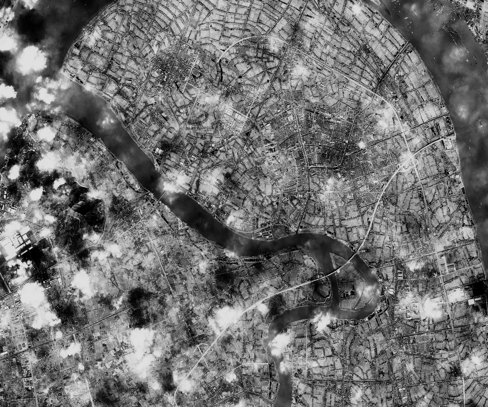

# FastViewGener: Fast Overviews Generator for Large Satellite Images

[](https://github.com/Jeiluo/Fastview4Geo)  
[](https://github.com/Jeiluo/Fastview4Geo)  
[](http://www.apache.org/licenses/)  


A project that generates fast overviews for **PANCHROMATIC** and **MULTISPECTRAL** satellite images of a maximum size of 4GB with adaptive color adjustment.

Contributor:[Haojun Tang](https://donaldtrump-coder.github.io/), [Jiahao Zhou](https://github.com/Jeiluo)

---

## Usage
**In config file:**<br>
```
config.yaml
├── data
│   ├── filename: string
│   └── stretch: enum
│          - linear
│          - log
│          - gamma
│          - tile_stretch
│          - piecewise_equal
│          - histo_equal
└── output
```

## Reuslts
<table style="width: 100%; table-layout: fixed; text-align: center; vertical-align: middle;">
  <tr>
    <th style="width: 18%;">Stretch Methods</th>
    <th style="width: 13%;">Linear</th>
    <th style="width: 13%;">Log</th>
    <th style="width: 13%;">Gamma</th>
    <th style="width: 13%;">Tile Stretch</th>
    <th style="width: 13%;">Piecewise Equal</th>
    <th style="width: 13%;">Histogram Equal</th>
  </tr>
  <tr>
    <td>Sat1</td>
    <td style="padding: 0.5%;"></td>
    <td style="padding: 0.5%;"></td>
    <td style="padding: 0.5%;"></td>
    <td style="padding: 0.5%;"></td>
    <td style="padding: 0.5%;"></td>
    <td style="padding: 0.5%;"></td>
  </tr>
  <tr>
    <td>Sat2</td>
    <td style="padding: 0.5%;"></td>
    <td style="padding: 0.5%;"></td>
    <td style="padding: 0.5%;"></td>
    <td style="padding: 0.5%;"></td>
    <td style="padding: 0.5%;"></td>
    <td style="padding: 0.5%;"></td>
  </tr>
  <tr>
    <td>Sat3</td>
    <td style="padding: 0.5%;"></td>
    <td style="padding: 0.5%;"></td>
    <td style="padding: 0.5%;"></td>
    <td style="padding: 0.5%;"></td>
    <td style="padding: 0.5%;"></td>
    <td style="padding: 0.5%;"></td>
  </tr>
  <tr>
    <td>Sat4</td>
    <td style="padding: 0.5%;"></td>
    <td style="padding: 0.5%;"></td>
    <td style="padding: 0.5%;"></td>
    <td style="padding: 0.5%;"></td>
    <td style="padding: 0.5%;"></td>
    <td style="padding: 0.5%;"></td>
  </tr>
  <tr>
    <td>Sat5</td>
    <td style="padding: 0.5%;"></td>
    <td style="padding: 0.5%;"></td>
    <td style="padding: 0.5%;"></td>
    <td style="padding: 0.5%;"></td>
    <td style="padding: 0.5%;"></td>
    <td style="padding: 0.5%;"></td>
  </tr>
  <tr>
    <td>Sat7</td>
    <td style="padding: 0.5%;"></td>
    <td style="padding: 0.5%;"></td>
    <td style="padding: 0.5%;"></td>
    <td style="padding: 0.5%;"></td>
    <td style="padding: 0.5%;"></td>
    <td style="padding: 0.5%;"></td>
  </tr>
</table>

## Cloning the Project
```
git clone --recursive https://github.com/Jeiluo/Fastview4Geo
```
or
```
git clone https://github.com/Jeiluo/Fastview4Geo
git submodule update --
git submodule update --remote
```

## Build the whole project
For Windows: (in PowerShell)
```
.\install.ps1
cd build
cmake -DCMAKE_BUILD_TYPE=Release ..
cmake --build . --clean-first --config Release
cmake --install .
./Release/Fastview4Geo.exe
```

## Only build submodules
Build for libtiff:
```
mkdir build
cd build
mkdir libtiff
cd libtiff
cmake ..\..\trd_party\libtiff\ -DCMAKE_BUILD_TYPE=Release
cmake --build . --config Release
cmake --install . --prefix ./install/
cd ..
```
The module is build into path **./build/libtiff**.<br>
<br>
Build for Yaml-cpp:
```
cd build
mkdir yaml_cpp
cd yaml_cpp
cmake ..\..\trd_party\yaml_cpp\ -DCMAKE_BUILD_TYPE=Release
cmake --build . --config Release
cmake --install . --prefix ./install/
cd..
```
The module is build into path **./build/yaml_cpp**.<br>
<br>